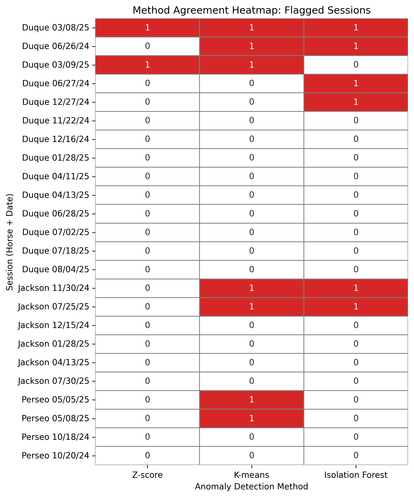
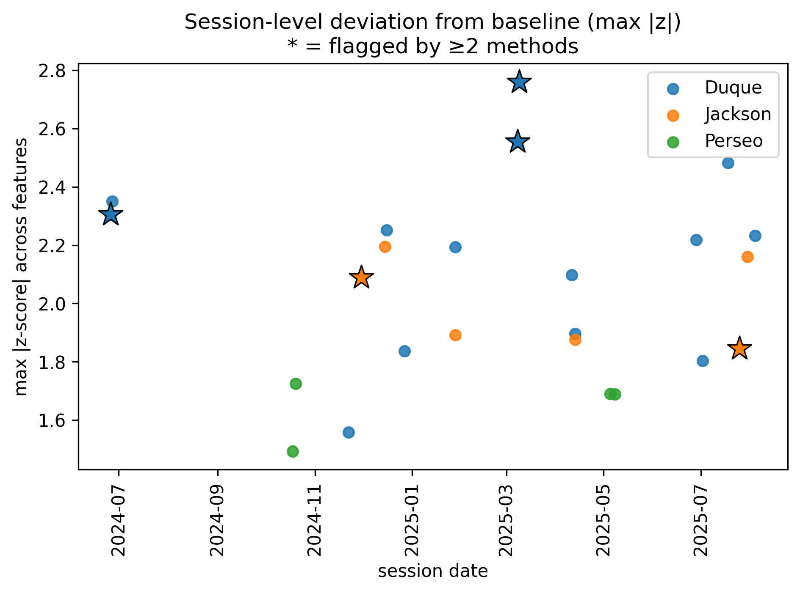
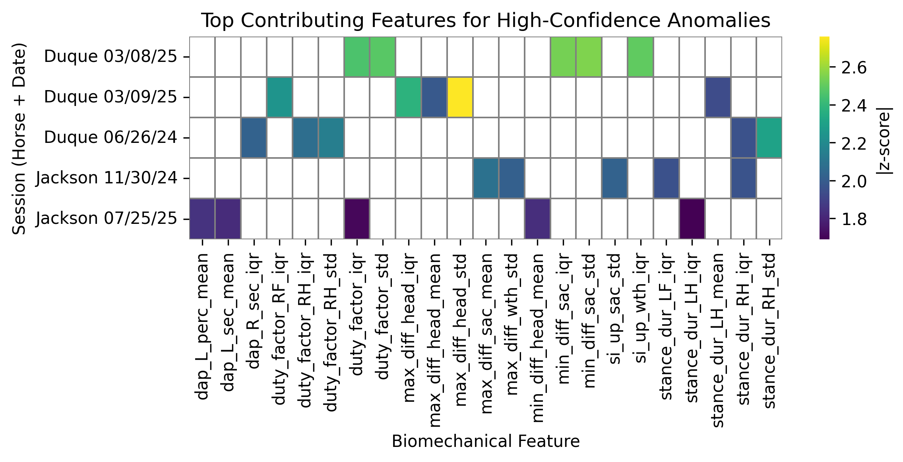

```{python}
#| label: load-packages
#| include: false

# Load packages here
import pandas as pd
import seaborn as sns

```

```{python}
#| label: setup
#| include: false
#| 
# Set up plot theme and figure resolution
sns.set_theme(style="whitegrid")
sns.set_context("notebook", font_scale=1.1)

import matplotlib.pyplot as plt
plt.rcParams['figure.dpi'] = 300
plt.rcParams['savefig.dpi'] = 300
plt.rcParams['figure.figsize'] = (6, 6 * 0.618)
```

```{python}
#| label: load-data
#| include: false
# Load data in Python
mtcars = sns.load_dataset('mpg').dropna()  # mtcars dataset is similar to the mpg dataset from seaborn
mtcars['speed'] = mtcars['horsepower'] / mtcars['weight']

penguins = sns.load_dataset('penguins').dropna()
```

## Introduction

-   Al-Marah Equine Center // Laura Miller

* EquiPro IMUs collect accelerometer data during exercise
* Data processed into stride-level biomechanical metrics

**Goal**: Use unsupervised learning techniques to model each horse's typical movement and automatically flag exercise sessions that deviate from this baseline. Such anomalies may reflect behavioral irregularities, equipment
malfunction, pain, or potential reinjury.

## Dataset

* Each session exported as CSV containing stride-level movemement variables.
  + Duque (14 sessions)
  + Jackson (6 sessions)
  + Perseo (5 sessions)

## Dataset {.smaller}
Sample of Equipro CSV output with stride-level biomechanical metrics from one exercise session.

```{python}
#| label: duque-head
#| warning: false
# Load one example Duque session

df_duque = pd.read_csv("Horses/Duque/20240626T082743-Duque-results.csv")

df_duque = pd.read_csv("Horses/Duque/20240626T082743-Duque-results.csv")
df_duque.head().style.set_properties(**{'font-size':'5px'})

# Show first 5 rows
df_duque.head()
```

# Methods

## Session-Level Features {.smaller}

We summarize 25 stride-level variables into session-level features.

| Group                     | Biomechanical Variables                                                                 | Count |
|-------------------------:|:------------------------------------------------------------------------------------------|------:|
| **Stride Metrics**        | stride duration, stride speed, stride length                                               | 3     |
| **Limb Loading / Timing** | duty factor (overall, LF, RF, LH, RH); stance duration (LF, RF, LH, RH)                    | 9     |
| **Coordination**          | diagonal advanced placement (left/right × seconds/percent)                                | 4     |
| **Trunk Symmetry**        | head, withers, sacrum asymmetry (min/max) + symmetry index (SI)                            | 9     |
| **Total**                 | —                                                                                        | **25** |

- Each variable is summarized per session using: mean, standard deviation, and interquartile range (IQR)

- Producing 75 engineered features per session


## Session-Level Feature Matrix {.smaller}

Feature matrix containing 24 exercise sessions and 75 engineered biomechanical movement features per session.

```{python}
import pandas as pd
from pathlib import Path

# Load the engineered feature matrix
data_path = Path("analysis") / "data" / "session_features_trot.csv"
session_features = pd.read_csv(data_path)

# Extract date from session_id (first 8 characters = YYYYMMDD)
session_features["session_date"] = pd.to_datetime(
    session_features["session_id"].str[:8],
    format="%Y%m%d"
).dt.strftime("%m/%d/%Y")

# Rows to display
rows_to_show = [1, 2, 16, 17, 22, 23]

display_cols = [
    "horse", "session_date",
    "stride_dur_mean", "stride_dur_std", "stride_dur_iqr"
]

# Display selected rows, clean formatting
session_features.loc[rows_to_show, display_cols] \
    .style.hide(axis="index")
```

## Anomaly Detection Framework

- Convert every feature to a z-score.

- Anomaly Detection Methods:

  - **Z-score Thresholding**

  - **K-means Cluster Distance**

  - **Isolation Forest**

Sessions flagged by multiple methods are more likely to reflect real gait irregularities.

# Results

## Per Method Anomalies

| Method               | Duque | Jackson | Perseo |
|---------------------|:-----:|:-------:|:------:|
| Z-score threshold   | **2** | 0 | 0 |
| K-means distance    | **3** | **2** | **2** |
| Isolation forest    | **4** | **2** | 0 |


## High-Confidence Anomalies {.smaller}

Sessions flagged by ≥2 methods (strongest evidence of abnormal movement):

| Horse   | Session Date | Methods Flagged |
| :-------: | :------------: | :-------------: |
| Duque   | 03/08/25     |      **3**      |
| Duque   | 03/09/25     |      **2**      |
| Duque   | 06/26/24     |      **2**      |
| Jackson | 11/30/24     |      **2**      |
| Jackson | 07/25/25     |      **2**      |

These sessions consistently deviate from each horse’s typical movement pattern.


## Method Agreement Heatmap

<div align="center">
{width="50%"}
</div>

## Max Deviation from Baseline {.smaller}

<div align="center">

{width="80%"}

</div>

## Feature Drivers of High-Confidence Anomalies {.smaller}

<div align="center">

{width="100%"}

</div>


## Interpreting Anomaly Drivers {.smaller}

Example: Duque 06/26/24

**Top contributing features**

- Right Hind duty factor and stance duration (duty_factor_RH_mean / stance_dur_RH_mean)

- Diagonal timing variability (DAP metrics: dap_L_, dap_R_)

- Trunk and limb asymmetry measures

**What this suggests**

- Prolonged loading of right hind limb: potential compensatory behavior

- Changes in diagonal timing: potential altered coordination during trot

- Redistribution of load toward hind limb could indicate subtle gait adaptation prior to visible abnormalities.

## Limitations 

- Small number of sessions per horse (5-14 sessions)
- External factors (environment, rider, equipment)
- Assumes stable baseline gait over time


## Conclusions {.smaller}

- Built horse-specific baseline gait profiles from session-level biomechanics
- Multiple anomaly detection methods identified deviations from baseline
- Only a small subset shows strong evidence of abnormality
  - High-confidence anomalies (flagged by ≥ 2 methods)

- For high-confidence anomalies, feature-level z-scores highlight which variables most contributed
  - Enables interpretation of gait changes underlying each flagged session

<div style="margin-top:10px; font-size:1.0em;">
**Takeaway:**  
Anomaly detection can reveal subtle, horse-specific gait changes that
may indicate early movement irregularities or reinjury risk before abnormalities are apparent through visual observation.
</div>